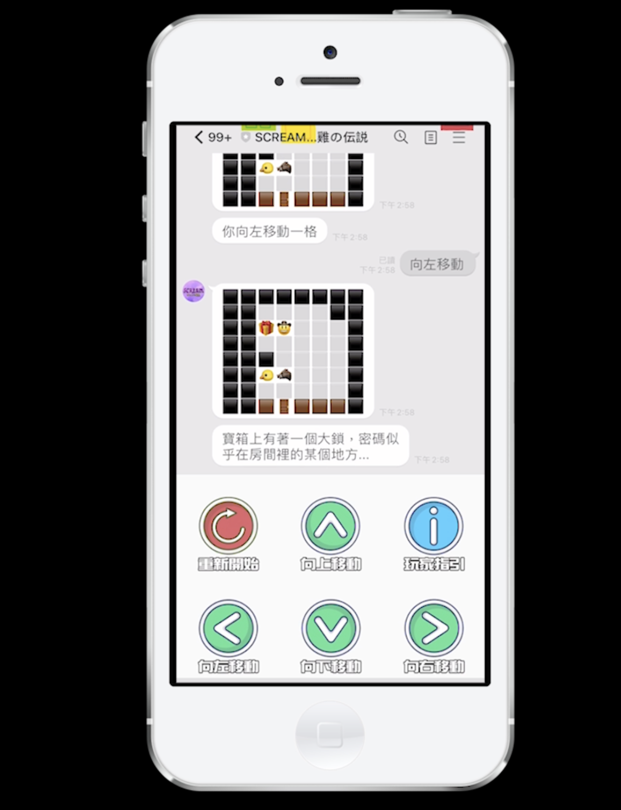
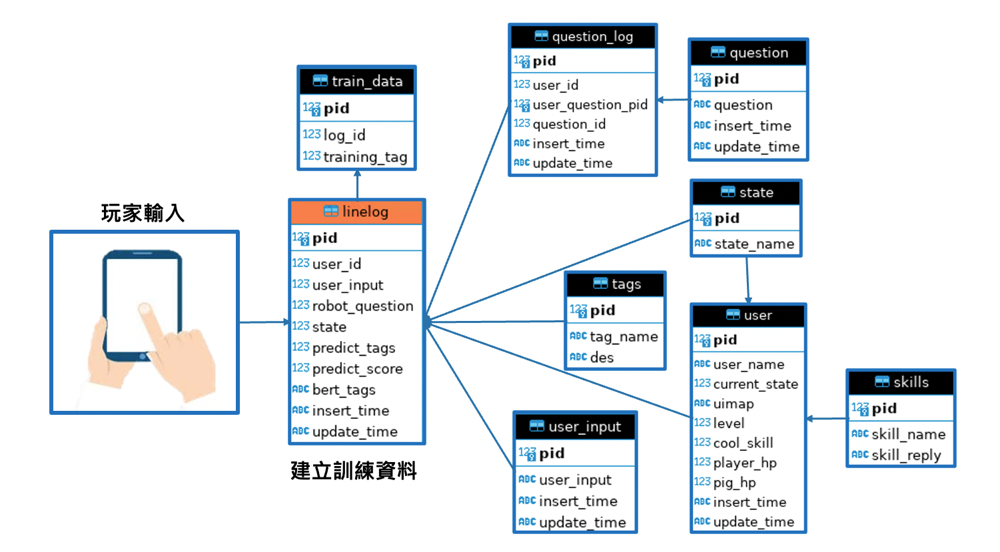
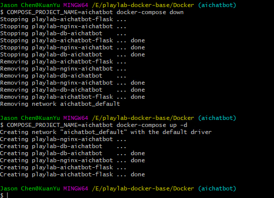

<div align="center">


</div>

## Abstract
The primary objective of our project is to develop a Line-based tabletop role-playing game (TRPG) that can offer a highly personalized and interactive gaming experience. To achieve this, we propose to integrate a relational database, which can store and access the player's interaction history, and utilize BERT text models to accurately understand the player's intended actions. As a key feature, the game's storyline will be dynamically adjusted according to the player's decisions and actions, thus enhancing the immersive quality of the game world. Our goal is to create a new mode of communication software application that can not only entertain but also offer a richer interactive experience.

## content
- [Demo](#demo)
- [Database Overview](#database-overview)
- [Edit Environment Variables](#edit-environment-variables)
- [Docker Setup](#docker-setup)
- [Build Your Line Bot](#build-your-line-bot)

## Demo
- snapshot of TRPG ([demo video](https://drive.google.com/file/d/1j5xv3xaRLSj1DdBsNkOmUgIYAr-NUbXv/view?usp=share_link))
<div align="center">



</div>

## Database Overview


## Edit Environment Variables
Modify the information of yourself in the red box.
```shell
vim env_setup.sh
```


## Docker Setup
Run the startup script to create docker container.
```shell
bash run.sh
```


## Build Your Line Bot
In the Line's **Basic setting** has `Channal secret` and **Messaging API**'s bottom has `channel access token`. Pass these keys to `www\secream\config.ini` enables the python script to connect to Linebot.


- restart your docker container
```shell
#close docker
COMPOSE_PROJECT_NAME=aichatbot docker-compose down
#open docker
COMPOSE_PROJECT_NAME=aichatbot docker-compose up -d
```


- ngrok connects the external network to the local machine
    - [ngrok](https://ngrok.com/) registration and installation
    - connect your ngrok account
    ```shell
    ngrok authtoken <your authtoken>
    ```
    
    - start ngrok service
    ```shell
    ngrok http 8082
    ```
    
    A URL will be forwarded so that the local server can communicate with the external server.

- Connect line bot and python script
Paste the string of URLs generated by ngrok into the webhook URL under the line message API and add `/callback` at the end.


- Click to `verify`, `success` means the connection is successful.


- If you successfully connect and test on linebot, the following image should be displayed.


- If you get a 500 error, there is something wrong with your code, you can check the `/tmp/uWSGI.log` in docker container for any error messages. 

